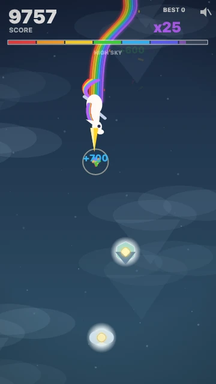

[](https://js13kgames.com/)
[](https://github.com/features/copilot)


Created for [js13kGames](https://js13kgames.com/) competition.
**Theme:** Rainbows and Unicorns. **Constraint:** web only, <= 13KB.

# DR1LL3R

<p align="center">
  <a href="#development">
    
  </a>
</p>

Drill glowing cores horn-first, dodge deadly spikes, and chain hits to unleash a skyward ***Double Rainbow**. What. Does. It. Mean?!?

### [🌈 Play now →](#development)

Run locally using the instructions below, or download the [release ZIP](dist/unicorn-horn-drill.zip),
extract it, and open `index.html`.

  **Controls:** <kbd>←</kbd> <kbd>→</kbd> or <kbd>A</kbd> <kbd>D</kbd> steer · mouse movement or touch-drag also steers · <kbd>M</kbd> or tap the speaker to mute

  Press any key or tap to start or restart. Line up your horn with glowing cores:
  body hits and red spikes end the run, and missing a core resets your combo.

## Features

- Horn-first arcade drilling with keyboard, mouse, and touch controls.
- Graphics and audio generated in code, with no runtime dependencies.
- Chain 28 hits to trigger Double Rainbow: fly upward with a second unicorn and rainbow trails, earning double hit scores for 9.5 seconds.
- After the first Double Rainbow, descent stays 6% faster for the rest of the run. Chase a best score saved locally.

## Development

Requires [Node.js](https://nodejs.org/) 18 or newer and npm.

```sh
# Install dependencies
npm ci

# Run locally
npm start

# Build the submission
npm run build
```

Open http://127.0.0.1:8080/. The source version needs `npm start`; it cannot run
directly from disk. Run tests with `npm test`.

Build output: `dist/unicorn-horn-drill.zip`.

The build uses esbuild to produce a standalone `index.html` and package it in the
submission ZIP. It fails if the ZIP reaches 13,000 bytes.

Development URL options: `?seed=42&autopilot=1`, `?start=run`, and `?mute=1`.
These and the `window.__uhd` debug hook are removed from release builds.

## Contributing

Contributions welcome! This was a short-lived competition project, so ongoing
maintenance isn't guaranteed. Feel free to fork it and make it your own.

## License

[MIT](LICENSE).
